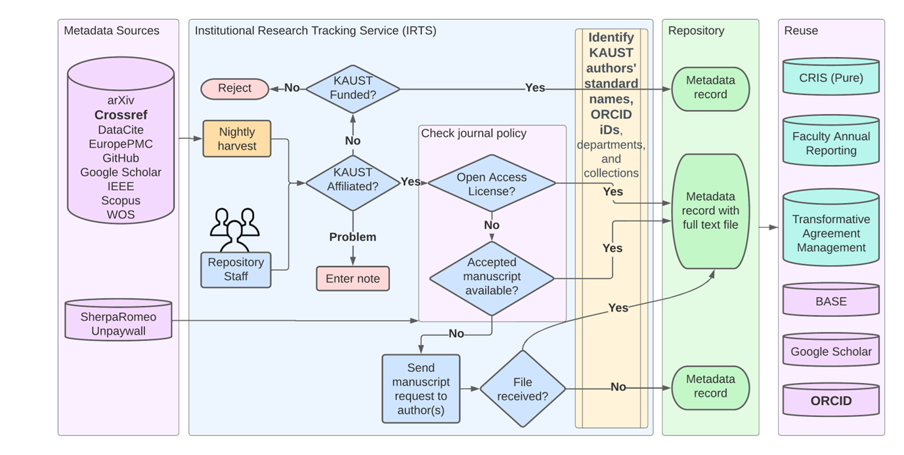

# Institutional Research Tracking System 

The Institutional Research Tracking System (IRTS) is a core component of KAUST Library infrastructure that tracks the research output of the university. The original need to track the output was to comply with our Open Access policy. "How do we are complaint if we don't what is out there?"

A high level overview of IRST architecture is presented in the picture below.



# Code Structure
[include.php](include.php) loads the configuration and function files that make up the application. Check this file to see what is being included and from where. A summary of the key directories is below

## Configuration
There are two sets of configuration files.

### IRTS Config
Constants used by IRTS, mostly the URLs for different metadata source APIs are in [constants.php](config/constants_template.php). API keys for the metadata sources that require them are in [credentials.php](config/credentials_template.php)

### Shared Config
IRTS loads database connections, and most other configurations and credentials from the shared configuration in [config/shared](config/shared). The connection to DSpace is set based on the shared configuration.

## Functions
Functions are split into two groups.

### IRTS Functions
IRTS specific functions are in [functions](functions).

### Shared Functions
Some functions are shared with other applications and are in [functions/shared](functions/shared).

## Database
IRTS has its own database. It also interacts with several other local MySQL databases as needed. Below is a summary of the tables in the irts database.

### mappings
This table maps metadata source fields to the standard fields, normally Dublin Core, used in IRTS and DSpace.

### messages
This table logs the reports and summaries from the cron tasks.

### metadata
This table holds the metadata harvested from all of the different sources, including DSpace, as well as information entered into IRTS forms.

### sourceData
This table holds the original XML or JSON harvested from a metadata source.

### transformations
In some cases the metadata values need to be transformed, such as author names being changed from "First Name Last Name" format to "Last Name, First Name" format. These changes are defined in this table.

### users
This table lists the users who have roles to access specific forms.

## Interfaces

The [public_html/forms](public_html/forms) directory contains the forms that users interact with in the browser.

### Review Center

[reviewCenter.php](public_html/forms/reviewCenter.php) is the primary user interface.


## Tasks
Automated tasks are run under /data/scripts/launch_script.sh which handles logging and sending email notices for errors. There are two groups of automated tasks:

1. **Harvest tasks**
These tasks are called through [harvest.php](tasks/harvest.php) and use the functions specific to each source in [sources](sources). 

### harvest external metadata sources - once a day
   ```commonlisp
    # IRTS - daily harvest of all listed sources
    10 2 * * * /data/scripts/launch_script.sh /var/www/irts/tasks/harvest.php source=arxiv,crossref,europePMC,github,ieee,scopus,unpaywall,wos
   ```

### harvest repository metadata via DSpace REST API - every 10 minutes
   ```commonlisp
    # IRTS - harvest new and modified repository records to irts metadata table every 10 minutes
    */10 * * * * /data/scripts/launch_script.sh /var/www/irts/tasks/harvest.php source=dspace
   ```

### harvest repository metadata via OAI-PMH - once a day
   ```commonlisp
    # IRTS - harvest new and modified community and collection handle relations as well as file information to irts metadata table daily based on OAI-PMH
    0 6 * * * /data/scripts/launch_script.sh /var/www/irts/tasks/harvest.php source=repository
   ```

2. **Update tasks**
These tasks are called through [runTask.php](bin/runTask.php) and use the functions specific to each task in [updates](updates)

### send embargo expiration reminders to authors and advisors - once a day (one week in advance of embargo expiration)
   ```commonlisp
    # IRTS - send embargo expiration reminders one week in advance - nightly at 2AM
    0 2 * * * /data/scripts/launch_script.sh /var/www/irts/bin/runTask.php task=update process=sendEmbargoExpirationNotices
   ```
### send poster embargo expiration reminders for  to author and PIs one week in advance - nightly at 2AM
 ```commonlisp
  # IRTS - send embargo expiration reminders for posters one week in advance - nightly at 2AM
  0 2 * * * /data/scripts/launch_script.sh  /var/www/irts/bin/runTask.php task=update process=sendPosterEmbargoExpirationNotices
```
### update local person entry in metadata table with new ORCIDs from IOI - once a day
   ```commonlisp
    # IRTS - update local person entries in IRTS with new ORCIDs from IOI
    0 2 * * * /data/scripts/launch_script.sh /var/www/irts/bin/runTask.php task=update process=updateLocalPersonsWithNewORCIDs
   ```
### update tables used by Power BI reports
   ```commonlisp
   # IRTS - daily update of dashboard data
   0 22 * * * /data/scripts/launch_script.sh /var/www/irts/bin/runTask.php task=update process=updateRepositoryDashboardDataTables
   ```